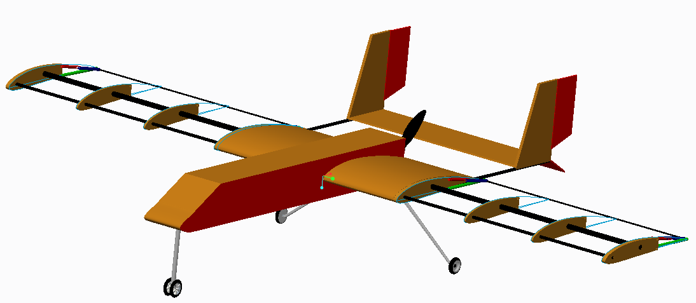
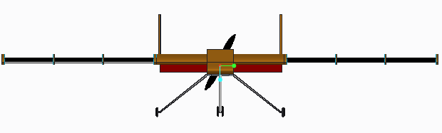
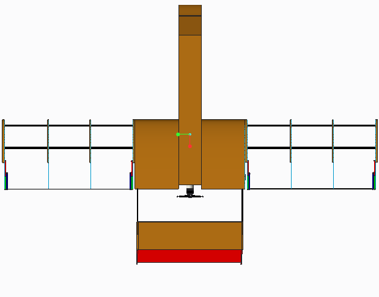
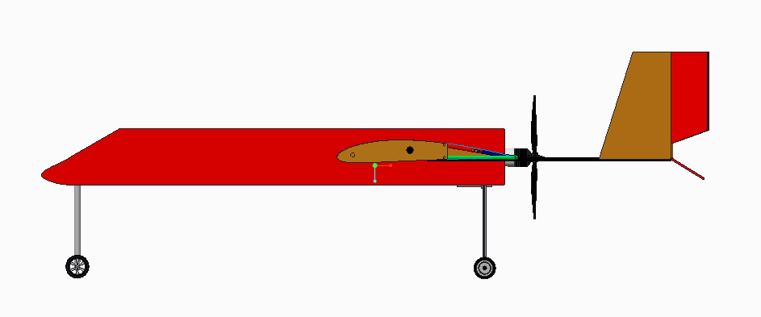
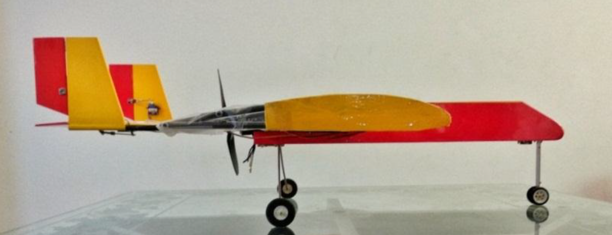
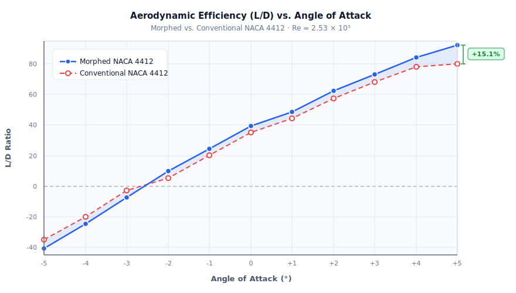
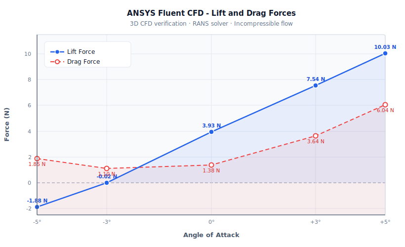

# Morphing Wing UAV - Design, Analysis & Testing

**B.Sc. Final Year Design Project** | Institute of Space Technology  
**Author:** Muhammad Irtaza Khan  

---

## Overview

Conventional fixed wings cannot adapt their shape during flight, forcing a trade-off between efficiency at different airspeeds and altitudes. This project designs, simulates, and physically tests a **camber-morphing wing** for a fixed-wing UAV, replacing traditional hinged flaps with a smooth, continuously deforming surface actuated by servo motors.

The morphing mechanism uses an internal **slider-pin linkage** that reshapes the wing camber as the angle of attack changes, achieving higher aerodynamic efficiency with no discrete control surface gaps or hinge drag.

---

## CAD Model

<p align="center">
  
</p>

<p align="center">
  
  
  
</p>

<p align="center">
  
  <br/>
  <em>Physical Prototype</em>
</p>

---

## Key Results

| Metric | Conventional NACA 4412 | Morphed NACA 4412 | Improvement |
|--------|----------------------|-------------------|-------------|
| Max CL/CD (at AOA = +5°) | 80.12 | **92.22** | **+15.1%** |
| CL/CD at AOA = 0° | 35.13 | **39.28** | **+11.8%** |
| Takeoff distance | 150 ft | **135 ft** | **-10%** |

The 10% takeoff distance reduction was **experimentally validated** on a physical prototype.

---

## Methodology

### Airfoil & Design Parameters

- **Airfoil:** NACA 4412 (selected for mid-speed UAVs at 15-20 m/s with 12% max thickness).
- **Cruise velocity:** 14.35 m/s (47.4 ft/s).
- **Reynolds number:** Re = 2.53 x 10^5.
- **Chord:** 0.261 m · **Span:** 1.415 m · **Wing area:** 0.369 m²

### Morphing Mechanism

The internal linkage is a **slider-pin system** driven by servo motors. As the servo rotates, the pin slides along a track, deforming the trailing edge of the wing and changing the camber continuously. The outer skin is a thin polythene sheet (selected via traction testing for flexibility and torque compatibility) that maintains a smooth aerodynamic surface across all deflection angles.

### Analysis Pipeline

1. **JavaFoil** - 2D panel method analysis for dimensionless CL, CD, and L/D across AOA sweep (-5° to +5°).
2. **ANSYS Fluent** - 3D CFD for absolute lift and drag force verification; RANS solver, incompressible flow.
3. **Physical prototype** - Takeoff distance measured with and without morphing engaged.

---

## Aerodynamic Results

### Coefficients vs. Angle of Attack (JavaFoil)

<table><tr>
<td valign="top">

| AOA (°) | CL | CD | L/D (Morphed) | L/D (Conventional) |
|---------|----|----|--------------|-------------------|
| -5 | -0.610 | 0.0120 | -40.66 | -34.96 |
| -4 | -0.320 | 0.0107 | -24.61 | -20.17 |
| -3 | -0.110 | 0.0100 |  -7.33 |  -2.66 |
| -2 |  0.120 | 0.0125 |  10.00 |   5.12 |
| -1 |  0.340 | 0.0140 |  24.28 |  20.16 |
|  0 |  0.550 | 0.0150 |  39.28 |  35.13 |
| +1 |  0.780 | 0.0160 |  48.75 |  44.20 |
| +2 |  1.000 | 0.0163 |  62.50 |  57.42 |
| +3 |  1.210 | 0.0165 |  73.33 |  68.29 |
| +4 |  1.430 | 0.0170 |  84.11 |  78.11 |
| +5 |  **1.660** | **0.0180** |  **92.22** |  **80.12** |

Full data: [`results/aerodynamic_data.csv`](results/aerodynamic_data.csv).

</td>
<td valign="top">



</td>
</tr></table>

### ANSYS Fluent Force Verification

<table><tr>
<td valign="top">

| AOA (°) | Lift (N) | Drag (N) |
|---------|----------|----------|
| -5 | -1.880 | 1.854 |
| -3 | -0.020 | 1.101 |
|  0 |  3.932 | 1.380 |
| +3 |  7.540 | 3.643 |
| +5 | **10.030** | 6.042 |

</td>
<td valign="top">



</td>
</tr></table>

---

## Repository Structure

```
├── results/
│   ├── isometric.PNG
│   ├── front.PNG
│   ├── top.PNG
│   ├── side.PNG
│   ├── back.PNG
│   ├── Prototype_pic.png
│   ├── aerodynamic_data.csv
│   ├── ld_vs_aoa.svg
│   └── ansys_forces.svg
├── FYP Presentation/
│   └── FYP Presentation.pdf
└── README.md
```

---

## Tools Used

| Tool | Purpose |
|------|---------|
| PTC Creo Parametric | 3D CAD - full UAV assembly and morphing mechanism |
| ANSYS Workbench (Fluent) | CFD - RANS solver, lift/drag force computation |
| JavaFoil | 2D panel method - CL, CD, L/D vs. AOA sweep |
| MATLAB | Structural and torque calculations |

---

## Acknowledgments

1. Supervised by **Dr. Owaisur Rahman Shah** and **Dr. Muhammad Zubair Khan** at the Institute of Space Technology, Islamabad.  
2. Airfoil selection informed by the work of Vladimir Brusov & Vladimir Petruchik on mid-speed UAV profiles.
